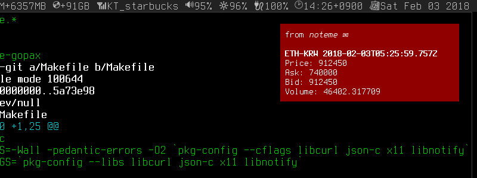

noteme-gopax
============

A GOPAX watcher with X desktop notifications for GNU/Linux ::

  $ noteme-gopax ETH-KRW -u 910000 &

It will alert you when the price exceeds 910000, for every 3 seconds.

Dependencies
------------

* libcurl
* json-c
* X11
* libnotify

Installation
------------

::

  $ git clone https://github.com/dgkim5360/noteme-gopax.git
  $ sudo make install

Usage
-----

::

  Usage: noteme-gopax [-hstulv] [trading-pair]
  A Gopax watcher with X desktop notifications

  -h           print this help message
  -s int=1800  time to repeat in seconds (30 minutes by default)
  -t int=3     time interval to check in seconds
  -u int       upper threshold for critical notifications
  -l int       lower threshold for critical notifications
  -v           show all normal notifications

Also, `an Example of running as a daemon`__ would be helpful.

__ https://github.com/dgkim5360/noteme#example
